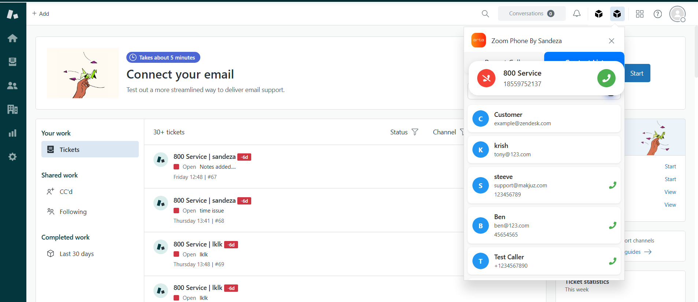
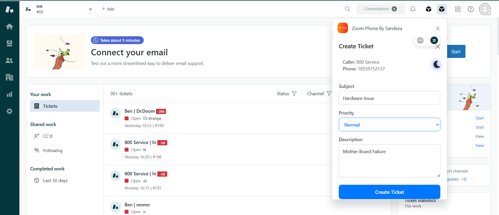
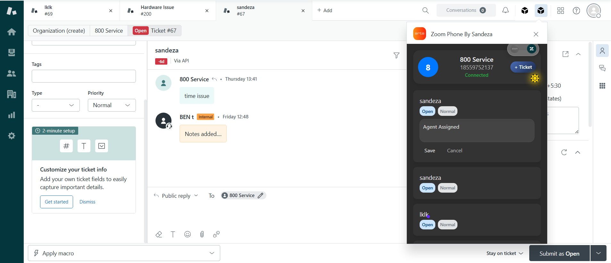

# Overview

The **Zoom Phone + Zendesk Widget** integrates Zoom Phone directly into Zendesk Support.  

Agents can manage calls, tickets, and notes without leaving Zendesk.

## How It Works

1. **Login:** Agents enter their Zoom email and password in the embedded Zoom iframe.  

2. **Incoming Calls:** When a call is received, the widget displays:

   - Caller’s Zendesk ticket (if exists)  
   - Options to create a new ticket or add notes to an existing ticket  
  

3. **Ticket Navigation:** Clicking a ticket in the widget opens it directly in Zendesk.  
4. **Outgoing Calls:** Agents can dial customers using the widget interface.  

## Features

- **Screen Pop:** Displays relevant customer ticket info instantly.  
- **Ticket Creation:** Easily create tickets for new calls.  
- **Add Notes:** Append notes to existing tickets without opening the ticket page manually.  
- **Direct Navigation:** Click a ticket to navigate directly to it in Zendesk.  
- **Secure Login:** Only Zoom email & password are required — no API keys needed.  

---

> Next: [Zoom Phone Setup](../zoomphone/setup.md)
